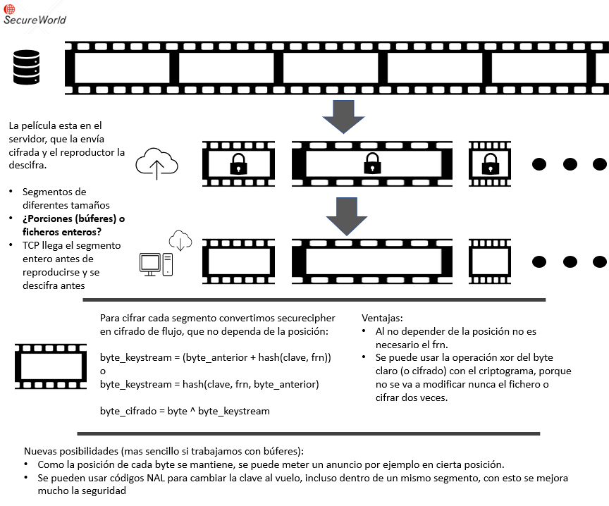

# SECURECIPHER_BY_BLOCKS
Adaptación de securecipher para que trabaje con bloques de datos en un escenario de comparticion de video

Hay dos proyectos en el repositorio:
1. Securecipher_N: Adaptacion de la libreria dinámica original para que trabaje con bloques
2. Cipher_by_block_validator: Para validar este nuevo cifrador (similar al dll validator del proyecto, pero con dos opciones para trabajar con bloques de distinto tamaño)

## Cambios en el cifrado
* Es un cifrador de flujo, que trata cada bloque de forma independiente y de manera conjunta, ya que el escenario de uso es distinto que el de Securemirror (trabajar con un sistema de ficheros en tiempo real)
* Cambios en el api de cifrado: Al tratar con bloques enteros, ya no se usa el parametro offset que era necesario en el escenario de Securemirror, ya que ahora las llamadas son para cifrar bloques enteros y no trozos de ficheros desordenados.
  ```python
  cipher(LPVOID out_buf, LPCVOID in_buf, DWORD size, struct KeyData* key);
  decipher(LPVOID out_buf, LPCVOID in_buf, DWORD size, struct KeyData* key);
  #La funcion init sigue igual
  init(struct Cipher* cipher_data_param);
  ```
* Se cambian dos requisitos:
  * Ya no es necesaria la posición: Te mandan un bloque entero de principio a fin, no tienes que conservar la posicion en un fragmento aleatorio de un fichero mas grande, como si ocurre en el escenario de Securemirror
  * Ya no es necesario que cifrar y descifrar sean distintos: Al player le llega el video cifrado, nadie va a cifrar dos veces para descifrarlo (usando la operacion xor) 
* Se mantienen los métodos de difusion y confusion del cifrado, lo que ha cambiado es el modo de operacion:
  ```python
  #Si antes era un cifrador dependiente de la posicion de esta forma
  byte_cifrado = byte_claro + hash(posicion,clave,frn)
  byte_descifrado = byte_claro - hash(posicion,clave,frn)
  #Ahora es un cifrador de flujo, que produce un keystream teniendo en cuenta la informacion anterior y se aplica a los bytes en claro/cifrados
  byte_keystream = hash(byte_anterior,clave)
  byte_cifrado = byte ^ byte_keystream
  ```
* FRN no es necesario: En este escenario no hace falta el FRN, por eso el hash se hace solo con el byte anterior y la clave
* Como se mantienen los métodos de difusion y confusion de Securecipher_N, el hash sigue trabajando con una entrada de 20 bytes, que antes se dividian entre la clave, el frn, y la posición, y ahora son para el byte anterior y la clave.
  * Se pueden usar claves mucho mas largas, de hasta 19bytes, si la clave es mas larga o mas corta que ese tamaño se adapta a 19 bytes, ya sea repitiendola, o haciendo xor con la porcion anterior de clave.

## Modificacion y pruebas
El proyecto Securecipher_N genera una libreria dinámica llamada *Securecipher_N2.dll* para usarla, hay que cargar la libreria e invocar a las funciones de cifrado y descifrado (descritas en el apartado anterior).

Para cargar la libreria y usarla se puede consultar el documento del proyecto [*A2.2.1.V1_5 Programación DLLs*](https://docs.google.com/document/d/1m_plJjkZNEg5odUYjWM3gvHNJZuQKP_EuHUCmcLkFhE/edit?usp=sharing)

El proyecto CIPHER_BY_BLOCK_VALIDATOR contiene el codigo necesario para cargar una dll de cifrado y ejecutarla. Es un fork del DLL_Validator del proyecto, que solo sirve para cifradores en este escenario, es decir con la api nueva de cifrado.

**Se recomienda compilar los proyectos en modo release/x64**
### Cipher_by_block_validator
Es el método mas sencillo para probar un cifrador de este tipo. Funciona mediante menus interactivos y permite validar los requisitos de cifrado, la velocidad del mismo, y hacer 

### Requisitos
La dll de cifrado tiene la siguiente api
```python
  cipher(LPVOID out_buf, LPCVOID in_buf, DWORD size, struct KeyData* key);
  decipher(LPVOID out_buf, LPCVOID in_buf, DWORD size, struct KeyData* key);
  ```
Donde:
* out_buf, in_buf: Son los bufferes de entrada y salida de cada funcion.
* size: El tamaño del buffer
* key: Una estructura que contiene información sobre la clave
```python
  struct KeyData {
		byte* data;
		int size;
		time_t expires;
	};
  ```
La funcion init se usa para obtener informacion del cifrador, por lo tanto su uso tambien depende del escenario
```python
  init(struct Cipher* cipher_data_param);
  ```
Donde la estructura Cipher es de la siguiente manera:
```python
struct Cipher {
		char* id;
		WCHAR* file_name;
		HINSTANCE lib_handle;
		int block_size;
		char* custom;
	};
```

## Escenario y propuesta original

