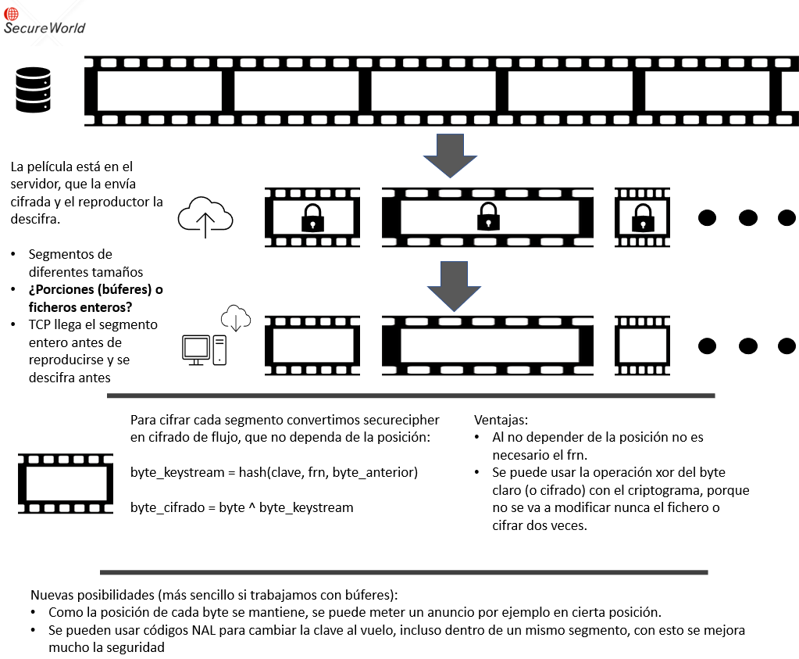
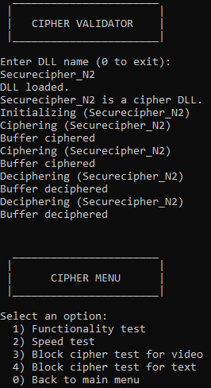

# SECURECIPHER_BY_BLOCKS
Adaptación de securecipher para que trabaje con bloques de datos en un escenario de comparticion de video

Hay tres proyectos en el repositorio:
1. Securecipher_N: Adaptacion de la libreria dinámica original para que trabaje con bloques
2. Cipher_by_block_validator: Para validar este nuevo cifrador (similar al dll validator del proyecto, pero con dos opciones para trabajar con bloques de distinto tamaño)
3. securecipher: Programa para uso regular, permite cifrar y descifrar ficheros. **Este es el que se usa en la colaboracion**

## Escenario y propuesta cifrador


## Programa securecipher
Uso:

securecipher.exe <-c|-d> <fichero_entrada.extension> <-k> <fichero_clave> <-N> <fichero_clave_nuevo>

Donde:
* <-c|-d>: indica el modo de operacion, cifrar o descifrar
* <fichero_entrada.extension>: El fichero que se quiere cifrar o descifrar, es importante incluir la extension del mismo
* <-k>: indica que el siguiente fichero es el fichero de clave
* <fichero_clave>: Un fichero que contiene la clave
* <-N>: Indica el modo del NAL, por ahora cambio de clave
* <fichero_clave_nuevo>: Indica el fichero de la clave nueva que se usará
  
Salida:
* Si el modo es cifrar: fichero_entrada_c.extension (el fichero cifrado)
* Si el modo es descifrar: fichero_entrada_d.extension (el fichero descifrado)

Donde poner los ficheros:
* Los ficheros que uses deben estar en la misma ubicacion que el ejecutable, por defecto en *securecipher/x64/Release*
* Hay ficheros para probar, de clave, de video y de texto.
* Además hay una carpeta que se llama *Ficheros para probar* que contiene mas ficheros de clave, de video y de texto

Ejemplo de uso (**Acordado en reunion 11-10-2023**):
cifrador -c <filename.kkk> -k <keyfile> -N <newkeyfile>: genera segmento cifrado con NAL de cambio de clave y clave
cifrador -d <filename.kkk> -k <keyfile>: genera segmento descifrado  usando keyfile y si hay NAL de cambio de clave , se sobreescribe la keyfile

Lado “server”
cifrador -c segment1.mp4 -k key1
cifrador -c segment2.mp4 -k key1 -N key2
cifrador -c segment3.mp4 -k key2
Lado “cliente”
cifrador -d segment1.mp4 -k key	// Key contiene key1
cifrador -d segment2.mp4 -k key	// Se sobreescribe key con key2
cifrador -d segment3.mp4 -k key	// Key ya contiene key2


## Cambios en el cifrado
* Es un cifrador de flujo, que trata cada bloque de forma independiente y de manera conjunta, ya que el escenario de uso es distinto que el de Securemirror (trabajar con un sistema de ficheros en tiempo real)
* Cambios en el api de cifrado: Al tratar con bloques enteros, ya no se usa el parametro offset que era necesario en el escenario de Securemirror, ya que ahora las llamadas son para cifrar bloques enteros y no trozos de ficheros desordenados.
  ```python
  int cipher(byte** out_buf, byte* in_buf, DWORD size, struct KeyData* key);
  int decipher(byte** out_buf, byte* in_buf, DWORD size, struct KeyData* key);
  #Donde el struct de keydata es como sigue:
  struct KeyData {
	byte* data;
	int size;
	struct KeyData* next_key;
	char* keyfile;
  };
  ```
* Se cambian dos requisitos:
  * Ya no es necesaria la posición: Te mandan un bloque entero de principio a fin, no tienes que conservar la posicion en un fragmento aleatorio de un fichero mas grande, como si ocurre en el escenario de Securemirror
  * Ya no es necesario que cifrar y descifrar sean distintos: Al player le llega el video cifrado, nadie va a cifrar dos veces para descifrarlo (usando la operacion xor) 
* Se mantienen los métodos de difusion y confusion del cifrado, lo que ha cambiado es el modo de operacion:
  ```python
  #Si antes era un cifrador dependiente de la posicion de esta forma
  byte_cifrado = byte_claro + hash(posicion,clave,frn)
  byte_descifrado = byte_claro - hash(posicion,clave,frn)
  #Ahora se produce un keystream teniendo en cuenta la informacion anterior y se aplica a los bytes en claro/cifrados
  byte_keystream = hash(byte_anterior,clave)
  byte_cifrado = byte ^ byte_keystream
  ```
* FRN no es necesario: En este escenario no hace falta el FRN, por eso el hash se hace solo con el byte anterior y la clave
* Como se mantienen los métodos de difusion y confusion de Securecipher_N, el hash sigue trabajando con una entrada de 20 bytes, que antes se dividian entre la clave, el frn, y la posición, y ahora son para el byte anterior y la clave.
  * Se pueden usar claves mucho mas largas, de hasta 19bytes, si la clave es mas larga o mas corta que ese tamaño se adapta a 19 bytes, ya sea repitiendola, o haciendo xor con la porcion anterior de clave.

## Modificacion y pruebas
El proyecto Securecipher_N genera una libreria dinámica llamada *Securecipher_N2.dll* para usarla, hay que cargar la libreria e invocar a las funciones de cifrado y descifrado (descritas en el apartado anterior).

Para cargar la libreria y usarla se puede consultar el documento del proyecto [*A2.2.1.V1_5 Programación DLLs*](https://docs.google.com/document/d/1m_plJjkZNEg5odUYjWM3gvHNJZuQKP_EuHUCmcLkFhE/edit?usp=sharing)

El proyecto CIPHER_BY_BLOCK_VALIDATOR contiene el codigo necesario para cargar una dll de cifrado y ejecutarla. Es un fork del DLL_Validator del proyecto, que solo sirve para cifradores en este escenario, es decir con la api nueva de cifrado.

**Se recomienda compilar los proyectos en modo release/x64**
### Cipher_by_block_validator
**Ya no es la mejor opcion para probar el cifrador, porque usa una api distinta, para hacer pruebas se recomienda el proyecto securecipher


Es el método mas sencillo para probar un cifrador de este tipo. Funciona mediante menus interactivos y permite validar los requisitos de cifrado, la velocidad del mismo, y hacer una prueba con trozos de un fichero de distintos tamaños.

Una vez indicas el nombre de la dll de cifrado se realizan unas pruebas en segundo plano y aparece el menu de validacion del cifrador con las siguientes opciones:
1. Functionality test: Para comprobar los requisitos funcionales del cifrado
2. Speed test: Para comprobar la velocidad del cifrado
3. Block ciper test for video: Se prueba el cifrado con trozos de un fichero de video de distintos tamaños. Los videos que se van a cifrar estan en la carpeta *trozos* del directorio de trabajo (x64/Realease/trozos). Los videos cifrados y descifrados se guardan en el mismo lugar 
4. Block cipher test for text: Como la anterior pero con un fichero de texto.(x64/Realease/trozos_txt)

### Requisitos
La dll de cifrado tiene la siguiente api
```python
  cipher(LPVOID out_buf, LPCVOID in_buf, DWORD size, struct KeyData* key);
  decipher(LPVOID out_buf, LPCVOID in_buf, DWORD size, struct KeyData* key);
  ```
Donde:
* out_buf, in_buf: Son los bufferes de entrada y salida de cada funcion.
* size: El tamaño del buffer
* key: Una estructura que contiene información sobre la clave
```python
  struct KeyData {
	byte* data;
	int size;
	time_t expires;
};
  ```
La funcion init se usa para obtener informacion del cifrador, por lo tanto su uso tambien depende del escenario
```python
  init(struct Cipher* cipher_data_param);
  ```
Donde la estructura Cipher es de la siguiente manera:
```python
struct Cipher {
	char* id;
	WCHAR* file_name;
	HINSTANCE lib_handle;
	int block_size;
	char* custom;
};
```

Para llamar a las funciones de la libreria es necesario:
```python
#Funciones exportadas de la libreria
typedef int(__stdcall* cipher_init_func_type)(struct Cipher*);
cipher_init_func_type cipher_init_func;
typedef int(__stdcall* cipher_func_type)(LPVOID, LPCVOID, DWORD, struct KeyData*);
cipher_func_type cipher_func;
cipher_func_type decipher_func;

#Structs necesarios
struct Cipher cipher;
struct KeyData* composed_key;

#Carga de la libreria
hLib = LoadLibraryW(dll);
#Relleno de ejemplo de los structs
cipher.lib_handle = hLib;
cipher.file_name = dll;
cipher.block_size = 8;
cipher.id = dll;

composed_key = malloc(1 * sizeof(struct KeyData));
composed_key->size = 5;
composed_key->data = malloc(composed_key->size, sizeof(byte));
composed_key->data = (byte*)"12345";
composed_key->expires = 0;

#Punto de entrada a las funciones
cipher_func = (cipher_func_type)GetProcAddress(hLib, "cipher");
decipher_func = (cipher_func_type)GetProcAddress(hLib, "decipher");
#Uso de las funciones
result = cipher_func(ciphered_buf, message, buf_size, composed_key);
result = decipher_func(deciphered_buf, ciphered_buf, buf_size, composed_key);

```
