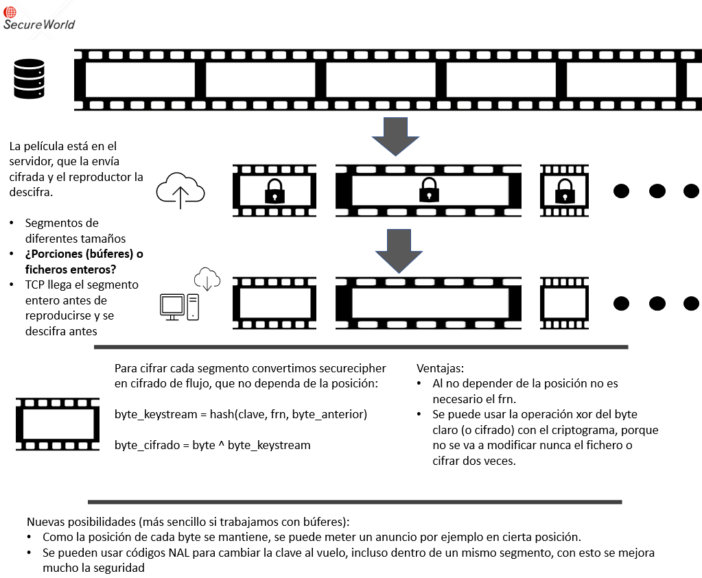
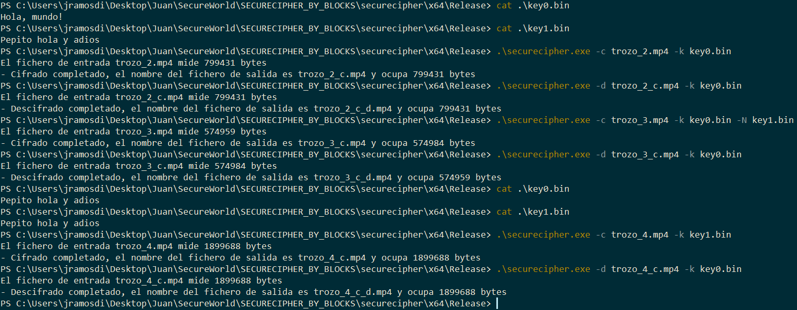

# SECURECIPHER_BY_BLOCKS
Adaptación de securecipher para que trabaje con bloques de datos en un escenario de comparticion de video

Hay tres proyectos en el repositorio:
1. Securecipher_N: Adaptacion de la libreria dinámica original para que trabaje con bloques
2. Cipher_by_block_validator: Para validar este nuevo cifrador (similar al dll validator del proyecto, pero con dos opciones para trabajar con bloques de distinto tamaño)
3. securecipher: Programa para uso regular, permite cifrar y descifrar ficheros. **Este es el que se usa en la colaboracion**

## Escenario y propuesta cifrador


El objetivo de esta variante del cifrador es cifrar segmentos completos de video de entre 2 y 10 segundos que componen una película en un servicio de streaming.

En este escenario de cifrado cambian los requisitos, ya que no hay que diseñar el mecanismo de cifrado en un contexto de trabajo en tiempo real (como ocurre en securemirror, que por ejemplo, hay que tener en cuenta peticiones de lecturas o escritura en posiciones muy alejadas en cualquier momento), por lo que se puede prescindir de la posición al cifrar/descifrar, esto permite que no sea necesario el mecanismo de FRN.

Al no tener el mecanismo de FRN, el cifrador va a depender de los bytes anteriores para cifrar, de esta forma se refuerza la seguridad al no contar con el FRN. Se evita el ataque por ficheros preparados, ya que al depender cada byte de los anteriores, cada fichero cifrado es muy distinto entre sí y un fichero de todo 0s no te proporciona información.

Al trabajar con segmentos enteros de video, se pueden introducir códigos para mejorar las seguridad:

 “Los nal son secuencias binarias prohibidas. Por ejemplo una secuencia concreta de bytes como "0-33-0-33-OP". Cuando se producen los primeros 4 bytes de forma natural, se debe hacer notar al player de algún modo, por ejemplo definiendo una operacion "0" que significa "esos 4 bytes eran naturales" y si OP es otro valor entonces se interpreta la operación y no se tienen en cuenta los 4 bytes "0-33-0-33".

En resumen, si aparece la secuencia prohibida de forma natural, se añade un byte extra para indicar que es una secuencia de datos. Y si dicho byte extra tiene un valor que no es cero, entonces los 4 bytes se tiran a la basura y se interpreta la operación que indique el byte extra. Ejemplos:

0-33-0-33-0 : se traduce por 0-33-0-33

0-33-0-33-23 : se ejecuta la operación 23 (por ejemplo cambio de clave de cifrado o cualquier otra cosa)”


## Programa securecipher
Uso:

securecipher.exe <-c|-d> <fichero_entrada.extension> <-k> <fichero_clave> <-N> <fichero_clave_nuevo>

Donde:
* <-c|-d>: indica el modo de operacion, cifrar o descifrar
* <fichero_entrada.extension>: El fichero que se quiere cifrar o descifrar, es importante incluir la extension del mismo
* <-k>: indica que el siguiente fichero es el fichero de clave
* <fichero_clave>: Un fichero que contiene la clave
* <-N>: Indica el modo del NAL, por ahora cambio de clave
* <fichero_clave_nuevo>: Indica el fichero de la clave nueva que se usará
  
Salida:
* Si el modo es cifrar: fichero_entrada_c.extension (el fichero cifrado)
* Si el modo es descifrar: fichero_entrada_d.extension (el fichero descifrado)

Donde poner los ficheros:
* Los ficheros que uses deben estar en la misma ubicacion que el ejecutable, por defecto en *securecipher/x64/Release*
* Hay ficheros para probar, de clave, de video y de texto.
* Además hay una carpeta que se llama *Ficheros para probar* que contiene mas ficheros de clave, de video y de texto

Ejemplo de uso (**Acordado en reunion 11-10-2023**):

cifrador -c <filename.kkk> -k <keyfile> -N <newkeyfile>: genera segmento cifrado con NAL de cambio de clave y clave  
cifrador -d <filename.kkk> -k <keyfile>: genera segmento descifrado  usando keyfile y si hay NAL de cambio de clave , se sobreescribe la keyfile  

Lado “server”  

cifrador -c segment1.mp4 -k key1  
cifrador -c segment2.mp4 -k key1 -N key2  
cifrador -c segment3.mp4 -k key2  

Lado “cliente”

cifrador -d segment1.mp4 -k key	// Key contiene key1  
cifrador -d segment2.mp4 -k key	// Se sobreescribe key con key2  
cifrador -d segment3.mp4 -k key	// Key ya contiene key2  



## Cambios en el cifrado
* Es un cifrador de flujo, que trata cada bloque de forma independiente y de manera conjunta, ya que el escenario de uso es distinto que el de Securemirror (trabajar con un sistema de ficheros en tiempo real)
* Cambios en el api de cifrado: Al tratar con bloques enteros, ya no se usa el parametro offset que era necesario en el escenario de Securemirror, ya que ahora las llamadas son para cifrar bloques enteros y no trozos de ficheros desordenados.
  ```python
  int cipher(byte** out_buf, byte* in_buf, DWORD size, struct KeyData* key);
  int decipher(byte** out_buf, byte* in_buf, DWORD size, struct KeyData* key);
  #Donde el struct de keydata es como sigue:
  struct KeyData {
	byte* data;
	int size;
	struct KeyData* next_key;
	char* keyfile;
  };
  ```
* La asignación de memoria (malloc) del buffer de salida se realiza dentro de las funciones de cifrado y descifrado: Al permitir el uso de NALs los tamaños de los buffers de entrada y salida pueden variar (tamaño original + NAL) en función de la nueva clave o los NAL naturales que haya, es por eso que el parámetro de buffer de salida es una dirección de memoria, que se trata de manera interna en las funciones de cifrado.
* Se cambian tres requisitos:
  * Ya no es necesaria la posición: Te mandan un bloque entero de principio a fin, no tienes que conservar la posicion en un fragmento aleatorio de un fichero mas grande, como si ocurre en el escenario de Securemirror
  * Ya no es necesario que cifrar y descifrar sean distintos: Al player le llega el video cifrado, nadie va a cifrar dos veces para descifrarlo (usando la operacion xor)
  * El uso de NALs hace que el fichero cifrado sea más grande que el original y el descifrado, rompiendo el requisito de mantener el tamaño de fichero.
* Se mantienen los métodos de difusion y confusion del cifrado, lo que ha cambiado es el modo de operacion:
  ```python
  #Si antes era un cifrador dependiente de la posicion de esta forma
  byte_cifrado = byte_claro + hash(posicion,clave,frn)
  byte_descifrado = byte_claro - hash(posicion,clave,frn)
  #Ahora se produce un keystream teniendo en cuenta la informacion anterior y se aplica a los bytes en claro/cifrados
  byte_keystream = hash(byte_anterior,clave)
  byte_cifrado = byte ^ byte_keystream
  ```
* FRN no es necesario: En este escenario no hace falta el FRN, por eso el hash se hace solo con el byte anterior y la clave
* Como se mantienen los métodos de difusion y confusion de Securecipher_N, el hash sigue trabajando con una entrada de 20 bytes, que antes se dividian entre la clave, el frn, y la posición, y ahora son para el byte anterior y la clave.
  * Se pueden usar claves mucho mas largas, de hasta 19bytes, si la clave es mas larga o mas corta que ese tamaño se adapta a 19 bytes, ya sea repitiendola, o haciendo xor con la porcion anterior de clave.
* Códigos NAL: En esta versión de cifrado se introduce la posibilidad de incluir códigos en el fichero cifrado, que se detectan al descifrar, y posibilitan ciertas operaciones.
	* Codigo NAL:  0x01 0x45 0xFC 0xC7 0xA2
	* Códigos de operación: 
		* 0x00: Nal natural, no se hace nada
		* 0x01: Nal de cambio de clave, el siguiente byte es el tamaño de la clave y los siguientes n bytes son la clave nueva
	* Cifrar: El NAL se introduce en el fichero cifrado, aumentando el tamaño del mismo.
	* Descifrar: Detecta el NAL, descarta los bytes que son del NAL y no del fichero, y aplica la operación necesaria. En el cambio de clave, guarda la nueva clave en el fichero de clave, y sigue descifrando con ella el resto de segmentos.
 * Como se permite el uso de códigos NAL, en el struct de la clave se ha incluido la posibilidad de meter una clave nueva, en caso de que uses el NAL de cambio de clave.
 * Se añade al struct de clave el nombre del fichero de clave, que es útil al trabajar con NALs (cuando se encuentra un NAL de clave al descifrar, esta clave nueva se escribe en el fichero de clave original, y es la que se usará)


